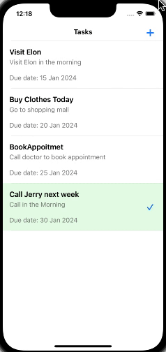

## Preview

This basic iOS app is to manage daily todos. User can create, edit and delete the todo tasks.

Project is built on Xcode 14.2, macOS 12.6.3

App Supports iOS 16.0 and above.

App is using MVVM architecture.

App uses Core-data for persistent storage.

To observe ViewModels Combine framework is used, in order to reduce the coupling between views and view-models. This approach also facilitate unit testing.

Dependency injections are used at some places to use classes in unit tests.

Project has some unit test cases covered. 

